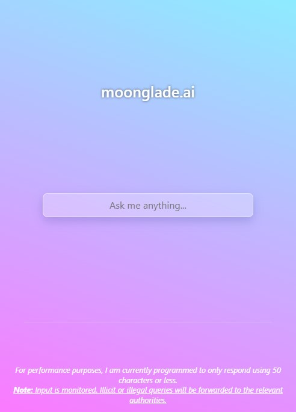

## Moonglade.ai

Moonglade.ai is a conversational AI platform that enables users and organizations quickly create natural language-based intelligent chatbot by leveraging OpenAI’s large-scale language models.

## Built with:

- React
- Node.js
- Express
- OpenAI AI ChatGPT-3 Models

## License

All Rights Reserved

Copyright (c) moongl4de

Created by moongl4de

THE SOFTWARE IS PROVIDED "AS IS", WITHOUT WARRANTY OF ANY KIND, EXPRESS OR
IMPLIED, INCLUDING BUT NOT LIMITED TO THE WARRANTIES OF MERCHANTABILITY,
FITNESS FOR A PARTICULAR PURPOSE AND NONINFRINGEMENT. IN NO EVENT SHALL THE
AUTHORS OR COPYRIGHT HOLDERS BE LIABLE FOR ANY CLAIM, DAMAGES OR OTHER
LIABILITY, WHETHER IN AN ACTION OF CONTRACT, TORT OR OTHERWISE, ARISING FROM,
OUT OF OR IN CONNECTION WITH THE SOFTWARE OR THE USE OR OTHER DEALINGS IN
THE SOFTWARE.
